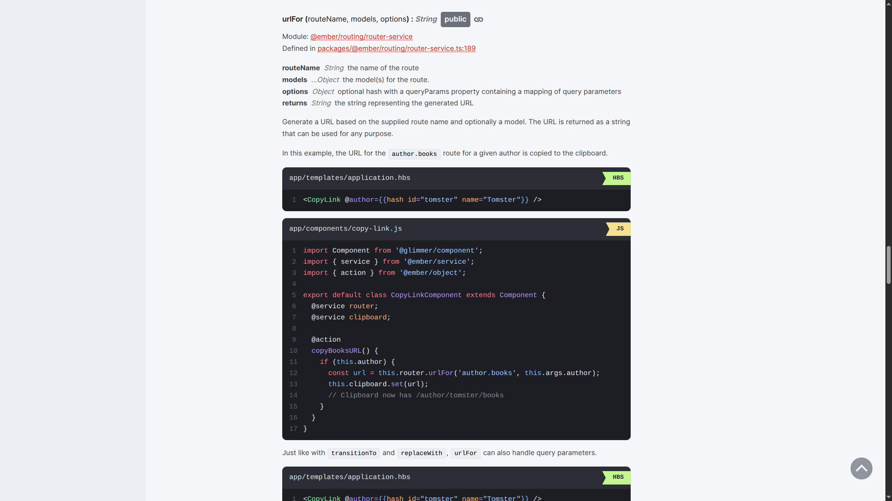
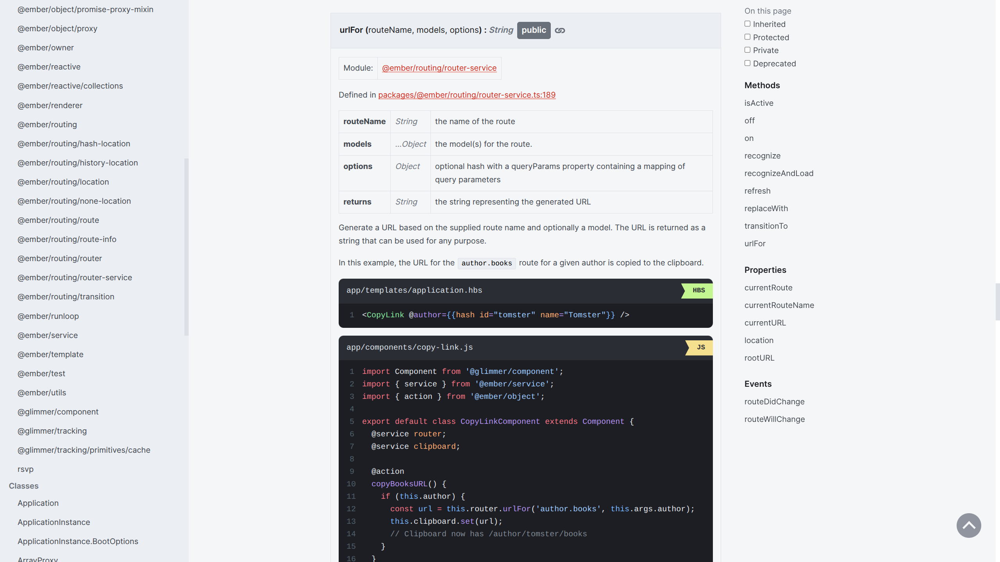

# 🐹 Refined Ember

Similar to [Refined GitHub](https://github.com/refined-github/refined-github), but for Ember websites:

- https://api.emberjs.com/
- https://cli.emberjs.com/
- https://guides.emberjs.com/

| Before                           | After                         |
| -------------------------------- | ----------------------------- |
|  |  |

## Setup

Add an extension to your browser that can inject stylesheets by URL.

E.g. `Super CSS Inject`:

- [Chrome Version](https://chromewebstore.google.com/detail/super-css-inject/pcfpmmmjdgngeidaggcahhoncahmpiin)
- [Firefox Version](https://addons.mozilla.org/en-US/firefox/addon/super-css-inject)

Configure the extension to inject https://bertdeblock.github.io/refined-ember/refined-ember.css for the websites listed above.
